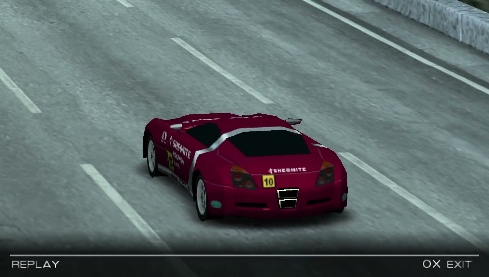
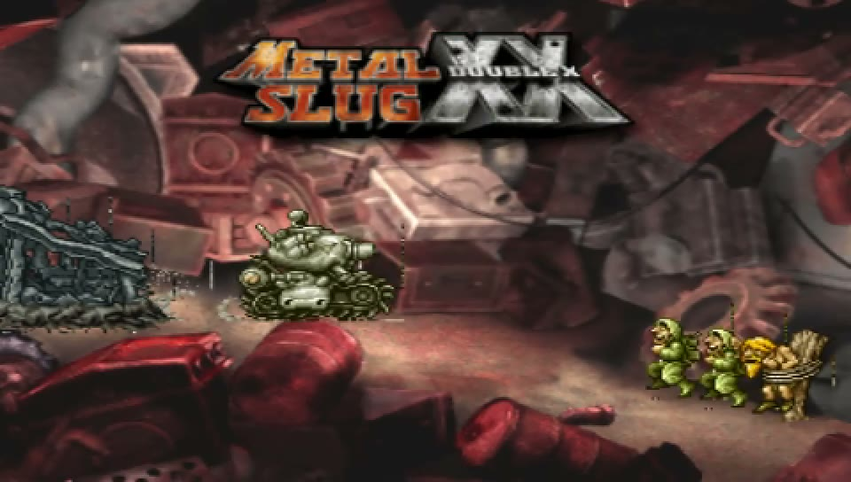
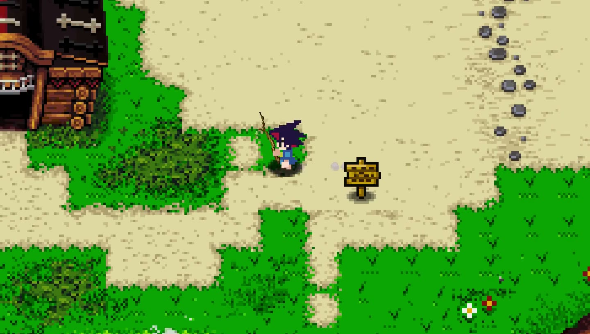
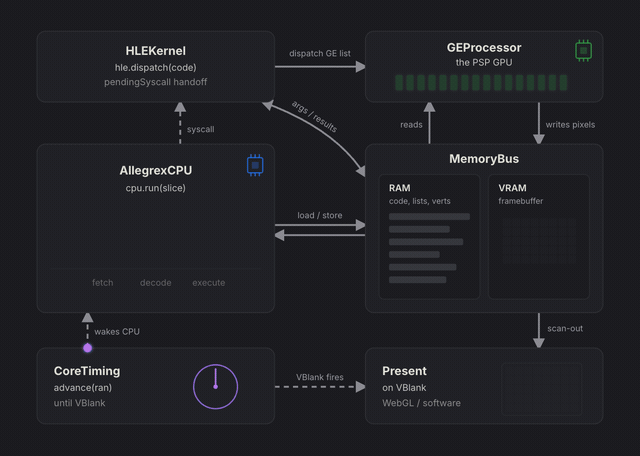

# PSP.js

A PSP emulator written in TypeScript that runs in the browser. It uses HLE (High-Level Emulation) like PPSSPP, so there's no BIOS ROM. PSP syscalls are reimplemented in TypeScript instead.

**[Try the emulator](https://mert.js.org/psp-js/)** · [Documentation](https://mert.js.org/psp-js/docs/) · [Compatibility list](https://mert.js.org/psp-js/docs/game-status)

It boots real games: decrypts KIRK-encrypted EBOOTs, loads ISO/PBP, runs the MIPS Allegrex CPU and VFPU, renders the GE over WebGL, decodes ATRAC3+ audio and MPEG/PSMF video, and saves game data in the browser.

Work in progress. Several commercial games boot to their menus and render, and the pspautotests CPU/kernel suite passes. Per-game status is on the [compatibility list](https://mert.js.org/psp-js/docs/game-status).

## Demos

Click a thumbnail to play (video only, no audio).

<table>
<tr>
<td><a href="https://mert.js.org/psp-js/docs/videos/ridge-racer.mp4"></a></td>
<td><a href="https://mert.js.org/psp-js/docs/videos/metal-slug.mp4"></a></td>
<td><a href="https://mert.js.org/psp-js/docs/videos/cladun.mp4"></a></td>
</tr>
<tr>
<td align="center">Ridge Racer (60s replay)</td>
<td align="center">Metal Slug (software renderer)</td>
<td align="center">Cladun (overworld)</td>
</tr>
</table>

## Documentation

The [full documentation](https://mert.js.org/psp-js/docs/) covers the user guide, architecture, and a per-subsystem and per-HLE-module reference. Run it locally with `npm run docs:dev`, or `npm run dev:all` to serve the app and docs side by side.

## Quick start

```bash
git submodule update --init --recursive   # pulls ppsspp-reference (and its nested pspautotests)
npm install
npm run dev
```

If you cloned without `--recurse-submodules`, run the submodule line first. The PPSSPP reference and the pspautotests it carries are needed for the test suite, not for running the emulator.

Open the printed localhost URL, pick a game, and load an ISO or PBP. Keyboard controls are in the in-app input settings.

The dev server sends COOP/COEP headers so `SharedArrayBuffer` works. The GE worker needs it, so a plain static file server won't do.

## Commands

```bash
npm run dev          # dev server (browser frontend)
npm run build:web    # production build to dist-web/
npm run typecheck    # tsc --noEmit
npx vitest run       # all tests
npx vitest run src/  # unit tests only (skip the ones that need ISOs)
```

Headless tools, run with `npx tsx`:

```bash
npx tsx tools/boot-iso.ts test/fixtures/puzzle-bobble.iso 100   # boot an ISO for N frames in node
npx tsx tools/game-diag.ts test/fixtures/gta.iso                # game diagnostics
npx tsx tools/find-dup-nids.ts                                  # check for duplicate NIDs
```

The node path has no GE worker, so it's for CPU/kernel/boot diagnostics, not rendering.

## Layout

How one frame runs (the CPU runs in slices, the GE draws inline, and CoreTiming fires the VBlank that presents). Animated version of the [architecture page](https://mert.js.org/psp-js/docs/guide/architecture):

[](https://mert.js.org/psp-js/docs/guide/architecture)

```
PSPEmulator (src/emulator.ts)
├── AllegrexCPU   MIPS CPU + VFPU, branch delay slots   (src/cpu/)
├── MemoryBus     64MB RAM, 2MB VRAM, BlockAllocator     (src/memory/)
├── HLEKernel     syscall dispatch, thread scheduler     (src/kernel/)
├── CoreTiming    cycle-accurate event scheduler         (src/timing/)
└── GEProcessor   GE command processing, runs inline     (src/gpu/)
```

| Path | What's there |
|---|---|
| `src/cpu/` | Allegrex CPU and VFPU (decoder, executor, registers). |
| `src/memory/` | MemoryBus routing plus a port of PPSSPP's BlockAllocator. |
| `src/kernel/` | HLEKernel and per-module `hle-*.ts` handlers. NID values live in `nids.ts`. |
| `src/gpu/` | The GE: command processor, vertex/lighting/texture pipeline, WebGL and software renderers. Runs inline on the main thread (the off-thread worker exists but is dead code). |
| `src/loader/` | ELF loader, PBP parser, and the PRX decrypter for encrypted EBOOTs. |
| `src/crypto/` | AES, SHA1, KIRK, AMCTRL. |
| `src/iso/` | ISO9660 reader, param.sfo parser, ISO metadata. |
| `src/audio/` | AudioWorklet engine and ATRAC3+ decode (via ffmpeg/libav). |
| `src/media/` | MPEG/PSMF video demux and decode (WebCodecs). |
| `src/storage/` | Browser-persisted savedata and file stores. |
| `src/frontend/` | The browser UI. Entry point is `main.ts`, loaded by `index.html`. |

## Testing

Tests run under vitest. `npx vitest run src/` covers the units (CPU, crypto, timing, parsers). `test/` boots real ISOs from `test/fixtures/` and runs the pspautotests harness in `test/pspautotests/`, which uses compiled `.prx` programs from the `ppsspp-reference/` submodule.

## PPSSPP reference

`ppsspp-reference/` is a submodule with the PPSSPP source. It's the ground truth for PSP behavior. When fixing a syscall, read the matching `Core/HLE/sce*.cpp` and match it instead of guessing. NIDs are checked against both `ppsspp_niddb.xml` and the source, and the source wins on conflict.

See `CLAUDE.md` for the deeper architecture notes and conventions.
